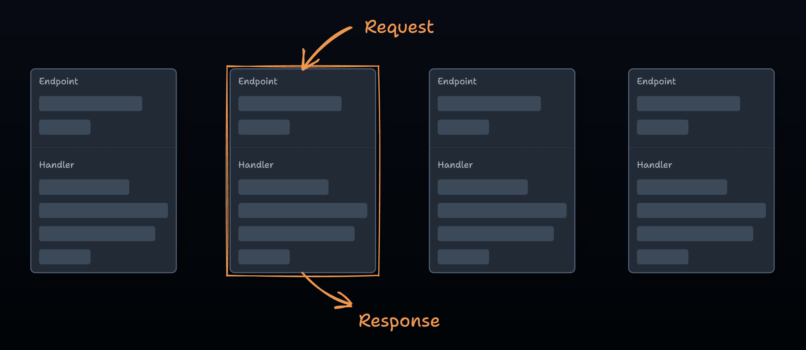

1. Title

FastEndpoints: A Straightforward Approach to .NET APIs

2. Abstract

Building .NET APIs often leads us down a familiar path: controllers, DTOs scattered across projects, MediatR, commands, queries, and application logic that somehow finds its way into every layer except where it belongs. After seeing the same problems arising across multiple projects, the search began for a more straightforward approach.

This talk explores FastEndpoints as an alternative to more conventional .NET API patterns. We'll look at how FastEndpoints encourages vertical slice architecture, keeps related code together, and maintains cleaner boundaries between application and domain logic. The session will provide an overview of FastEndpoints' key features and demonstrate how this approach differs from more conventional patterns.

Whether you're exploring different architectural approaches or are curious about tools that prioritize developer experience, this talk will give you a practical introduction to what FastEndpoints offers.

3. Bio

Isaac is a software developer whose programming journey began with an interest in game development that had him dabbling with Unity. While the passion for game development is still there, Isaac's typical work is largely focused on the enterprise space, delivering solutions for various clients.

Isaac is always on the lookout for ways to improve the developer experience, whether through tools or processes. He believes that focusing on making software development a truly enjoyable experience ultimately leads to better outcomes for clients and end-users.

4. Presentation image

5. Social media links

Blog: https://vivecuervo7.github.io/dev-blog/
LinkedIn: https://www.linkedin.com/in/isaac-dedini/

6. Length of talk (incl. Q&A)

~45 minutes

7. Headshot

